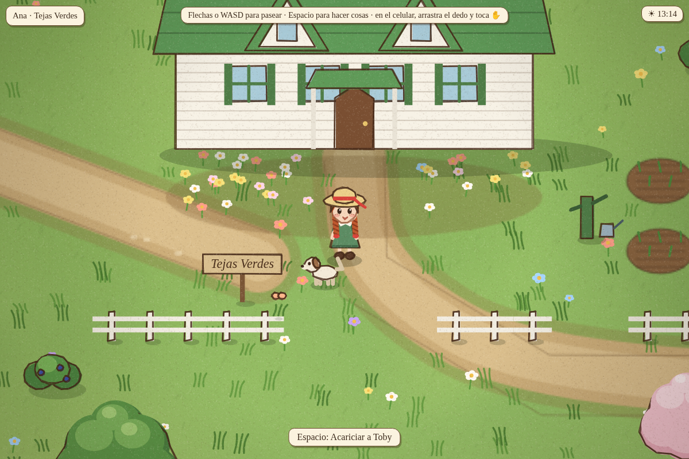
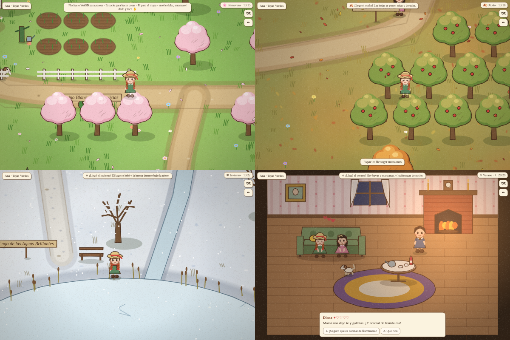
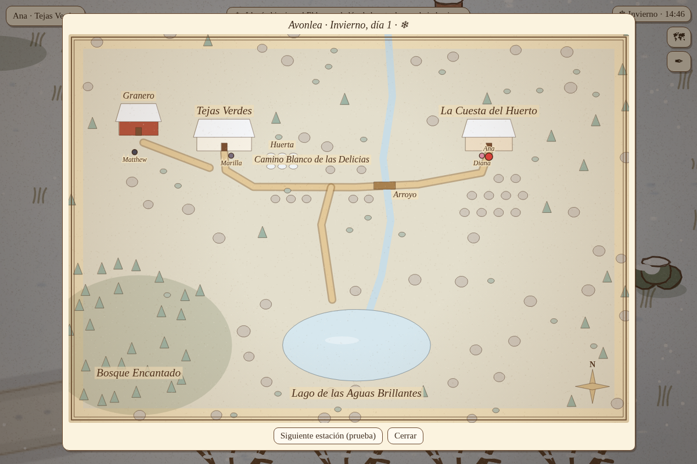
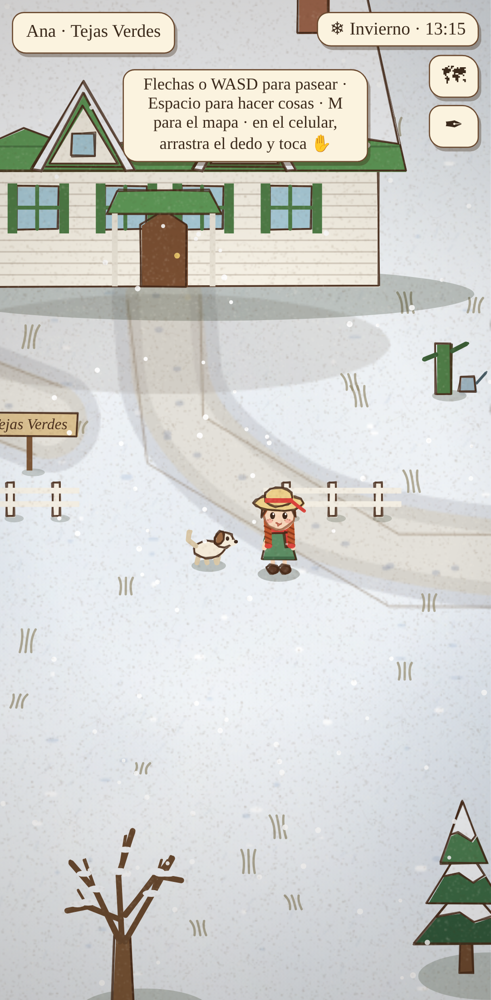
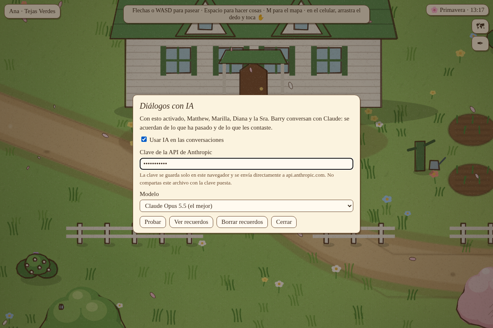
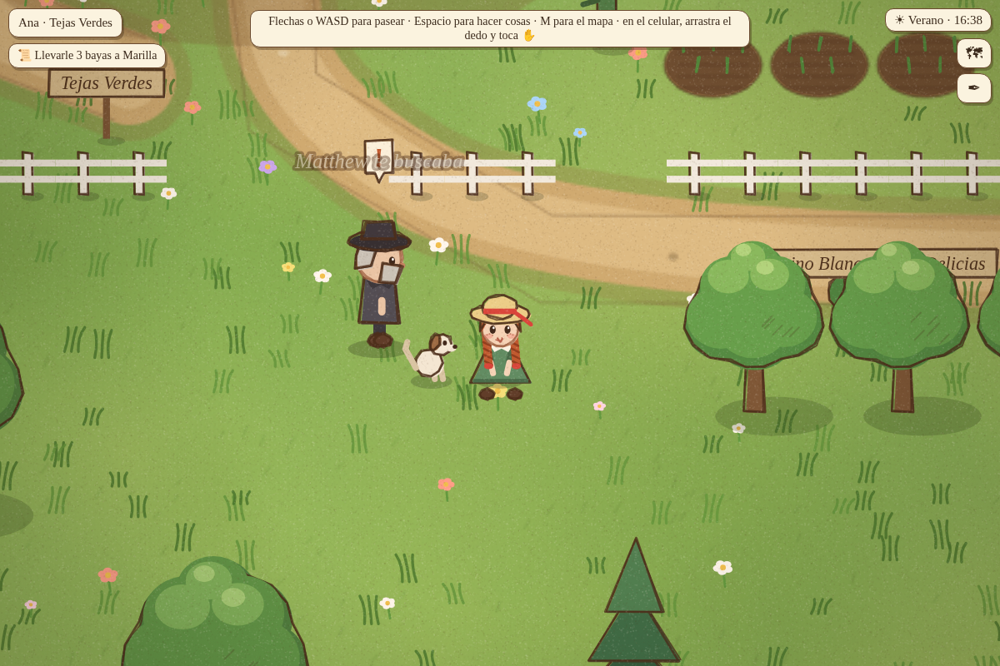

# Un día en Avonlea

Un juego tranquilo de mundo abierto, sin misiones, inspirado en *Ana de las Tejas Verdes* (L. M. Montgomery, 1908, de dominio público). Ana vive en **Tejas Verdes** con **Matthew** y **Marilla**, visita a su amiga del alma **Diana** en **La Cuesta del Huerto**, riega la huerta, cocina, acaricia a **Toby** y pasa los días como quiere, a lo largo de las cuatro estaciones.

Todo el juego es un solo archivo, [`index.html`](index.html): se abre en el navegador, en el computador o en el celular, sin instalar nada.

## Cómo jugar

- **Abrir:** descarga `index.html` y ábrelo en el navegador.
- **Moverse:** flechas o WASD (con Shift, más rápido); o toca el suelo y Ana va hasta allí (rodea los obstáculos). En el celular, también puedes arrastrar el dedo.
- **Hacer cosas:** toca (o haz clic en) la persona o el objeto: si Ana está cerca, lo hace al instante; si no, camina hasta allí y lo hace al llegar. Toca a Ana para dejar lo que lleva (la regadera, una taza...) o tomarse el té que preparó. No hay etiquetas sobre las cosas: lo que se puede hacer se descubre probando (el puntero cambia sobre lo que se puede tocar). Espacio, E o Enter hacen lo de más cerca.
- **Ana por su cuenta:** si no tocas nada durante unos 15 segundos, Ana hace lo suyo: la IA elige entre lo que puede hacer (regar, recoger bayas, acariciar a Toby, cocinar, ir a conversar con alguien, visitar una casa, pasear, soñar despierta, irse a dormir de noche...) y lo dice en voz alta; sin IA lo elige el juego. Lo hace sin apuro: pasea despacio, se detiene a mirar a su alrededor y se queda un buen rato en cada cosa antes de decidir la siguiente. Si hay una escena de la historia del día, va primero: Ana va adonde pasa y hace lo que la escena espera (agarrar la vaca, venderla, cocinar, llevarle algo a alguien). Cualquier tecla o toque te devuelve el control (se puede desactivar en ✒).
- **Decisiones con tiempo:** cuando un personaje te plantea algo (un encargo, una venta, qué hacer al final de una charla), una rayita se va acortando: si en 10 segundos no eliges, Ana decide sola, con su carácter (la IA) o según lo que necesita la historia, y dice en voz alta por qué.
- **Decir algo:** Enter o T (o el botón 💬) abren una línea para escribir lo que dice Ana. Los demás reaccionan, y la IA entiende si es una despedida («tengo que irme») o un destino («voy a la huerta»): la charla se corta y Ana se va. Alejarse caminando también termina una conversación.
- **Charlas:** los personajes conversan solos en globitos cuando Ana pasa cerca (y Ana también habla: no hay que elegir qué dice). Con Espacio sobre alguien, la charla es con ella; al final solo se decide lo importante (aceptar un encargo, regalar, pasear). Las charlas no detienen a nadie: Ana puede caminar mientras hablan (si se aleja, la charla termina), y quien tiene adónde ir sigue su camino conversando. Espacio, o tocar a quien habla, salta una frase; Esc sale.
- **Mapa:** M o el botón 🗺.
- **Diálogos con IA:** el botón ✒ (ver más abajo). Las charlas están pensadas para la IA; sin clave solo dicen unas frases escritas.

La partida se guarda sola en el navegador: lo que lleva Ana, lo que creció en la huerta, el cariño de cada uno (♥), el día y la estación.

## Qué se puede hacer

- **Acariciar a Toby**, el perro, que anda a su aire: trota alrededor de Ana, se va a husmear arbustos, árboles, la bomba o a ver quién anda por ahí (hasta unos 450 pasos), y vuelve corriendo si ella se aleja.
- **Regar la huerta:** toma la regadera en la bomba y riega los seis canteros. Cada uno crece hasta florecer (rosas, girasoles, lilas), y las flores se cortan para hacer ramos.
- **Recoger** bayas de los arbustos y manzanas del huerto de los Barry, en verano y otoño.
- **Cocinar** en la cocina de Tejas Verdes: tarta de bayas, compota de manzana o té.
- **Conversar y regalar** a Matthew, Marilla, Diana, la Sra. Barry y la Sra. Lynde, que le van tomando cariño.
- **Visitar a Diana** en La Cuesta del Huerto, **tomar el té** con ella en el sofá de la salita (con cordial de frambuesa, esta vez bien etiquetado), **calentarse junto al fuego** o **salir a pasear juntas**.
- **Subir a su pieza** por la escalera de la cocina: el cuarto del alero este, de paredes blancas, con la cama angosta, el espejo, el vestido marrón de mangas abullonadas y, por la ventana, el cerezo **Reina de las Nieves**. Por la noche Ana dice que tiene sueño; en su cama puede **dormir** (desde las 20:00) y el día empieza de nuevo al amanecer. Si pasa de las 2 de la mañana, se queda dormida sola.
- **Recostarse en el pasto** a mirar las nubes (tocando a Ana, o por su cuenta): si Diana va con ella, se recuesta a su lado; a veces Diana lo hace sola en su jardín.
- **Sentarse** en la banca del **Lago de las Aguas Brillantes**.
- **Avonlea es grande:** los lugares están lejos unos de otros (de Tejas Verdes a La Cuesta del Huerto hay un buen paseo; el lago y el Bosque Encantado quedan lejos).
- **El mapa de Avonlea:** es una aldea entera, como en los mapas de *Road to Avonlea*: el mar (el golfo de San Lorenzo) al norte y al este, con playas de arena roja, el hotel de White Sands y el faro; la estación de Bright River con el tren al noroeste; la aldea en el cruce de caminos (el ayuntamiento, la tienda de Lawson, la herrería, la imprenta del periódico, la pensión); el río con su puente cubierto rojo y la conservera; la **iglesia** blanca con su campanario, camino a la estación; la **escuela junto al río**, donde los alumnos dejan sus botellas de leche enfriándose en el agua (se pueden mirar); el campo de lupinos rosados; y al suroeste Tejas Verdes, el Lago de las Aguas Refulgentes, La Cuesta del Huerto, el Bosque Encantado y la Hondonada de Lynde, entre un mosaico de campos de cultivo. Todo está a distancias de verdad (cruzar el mapa a pie lleva su rato) y el reloj corre igual en todas partes. A la iglesia y a la escuela se puede entrar (bancos; pupitres y pizarra). Se puede ir caminando o con Matthew en la carreta (tocando el cartel junto al granero), que lleva de Tejas Verdes a la estación pasando por la aldea. En la carreta Ana va sentada a su lado y conversan sin detenerse; para **bajarse**, basta con moverse o tocar el suelo, y para **subirse** de nuevo, tocar la carreta. En la estación se entra al andén, con las vías y la pila de tablas donde Ana esperó a Matthew. El mapa es local (dibujado por el juego, sin imágenes ni internet) y carga en menos de medio segundo: el suelo se pinta por baldosas a medida que se necesitan.
- **Ir a un lugar desde el mapa:** con el mapa abierto (M o 🗺), basta tocar un lugar y Ana camina hasta allí **por los caminos** (los caminos forman una red; se busca la ruta más corta por ella, y con A* solo para llegar al camino y salir de él al final). En el mapa se ve la ruta punteada y una banderita en el destino; abrir el mapa no la detiene, y moverse con las flechas sí.
- **La gente de Avonlea:** unas cincuenta personas viven su día: los alumnos (Gilbert Blythe, Josie Pye, Ruby Gillis, Jane Andrews, Charlie Sloane, Sara Stanley, los King…) van a la escuela, juegan en el recreo junto al río y después se van al lago, a la playa o a la aldea; el Sr. Phillips da la clase (si Ana entra a la escuela, están todos en sus pupitres); el Sr. Lawson atiende su tienda, el herrero su herrería, el reverendo Allan y su esposa andan por la iglesia, Peg Bowen por su bosque, el capitán Jim junto al faro, y muchos vecinos van y vienen por los caminos con sus recados. Cada uno tiene su **ficha** (quién es, según los libros, y de qué le gusta hablar). Cuando Ana se acerca a alguien, cuando lo toca, o cuando dos vecinos se encuentran cerca de ella, **conversan**: con la IA, con un pedido muy corto («Eres X de Avonlea (L. M. Montgomery) y te encuentras con Y. Están en Z, es primavera y son las 12:30. Genera una conversación breve sobre L», donde L sale de los temas de su ficha o de la estación), unas 300 palabras por encuentro; sin IA, con sus frases escritas. Lo que Ana conversa queda en la bitácora.
- **Una sola ficha para todos:** los personajes principales y los del pueblo tienen la misma ficha (`fichaOf`): nombre, ficha (quiénes son), temas, frases (sin IA) y **memoria** (sí/no). Los principales tienen además lo suyo (encargos, regalos, rutinas). Con **«Memoria de los personajes»** (en ✒, apagada de inicio), los que tienen memoria en su ficha guardan lo que conversaron con Ana y lo recuerdan en la próxima conversación; apagada, nadie guarda nada y los prompts no llevan recuerdos. Hoy tienen memoria los principales y, del pueblo, Gilbert, la Sra. Allan, el capitán Jim, Peg Bowen, Jasper Dale y Sara Stanley.
- **Animales:** vacas, ovejas y caballos en los potreros, gallinas en los patios de las granjas, cerdos en la granja King, patos en el lago y en el río, gaviotas en la playa y volando sobre el mar, gatos en la aldea, y por los caminos el coche del correo y la carreta del Sr. Sloane.
- **La tienda de Lawson:** en la aldea, con su toldo a rayas; se puede entrar (de 8 a 18; fuera de hora está cerrada). Adentro hay estantes con frascos y telas, el mostrador con la balanza y los frascos de caramelos, y el Sr. Lawson detrás. Como en Avonlea, **no se usa dinero**: tocando al Sr. Lawson (o el mostrador) Ana elige primero qué quiere hacer y después qué: **cambiar** lo que trae (huevos, bayas, manzanas, un ramo, una tarta o una compota) por un capricho (una cinta para el pelo, caramelos de menta), o **llevar algo para la casa** (azúcar, cuerda) **a la libreta de los Cuthbert**, que Marilla paga a fin de mes (hasta dos cosas al día). Los huevos se juntan en el gallinero, junto al granero, una vez al día. La cinta y los caramelos se pueden regalar. El planificador usa lo mismo (Matthew se lleva azúcar a la libreta; Ana cambia bayas por una cinta). Solo el Sr. Shearer paga en dólares, por la vaca, como en el libro.
- **Metas y planificador (🎯), sin IA generativa:** el mundo tiene un modelo hecho de datos: cosas con etiquetas (comida, hecha a mano, animal…), lugares con lo que se puede hacer en ellos, personas con carácter, gustos, lo que compran y venden, y relaciones con ofensas. Doce verbos generales (ir, tomar, recoger, cocinar, dar, vender, comprar, conversar, disculparse, pedir, guiar y soltar una vaca) sirven para todos, Ana incluida. Una meta es una condición sobre el mundo («Dolly vendida», «Marilla tiene 2 compotas», «Diana perdonó a Ana»); un planificador (A* sobre estados, como el de los caminos) encuentra la secuencia de verbos más barata, y el personaje la ejecuta con las funciones del juego, buscando otro plan si algo cambia. Pueden pedirse cosas entre ellos (Marilla le pide manzanas a Ana; el Sr. Shearer le pide a Matthew que le venda la vaca). Las reglas sociales dependen del carácter: Diana perdona enseguida, Ana a Gilbert… un poco cada día. El botón 🎯 abre 17 metas de prueba para distintos personajes y muestra el plan de cada uno, paso a paso. La IA generativa queda apagada de inicio. **Pedir favores (instalar metas en otros):** cuando alguien no puede lograr algo solo (no sale de casa, está enfermo, no tiene cocina, o no le perdonan), busca a quién pedírselo: a su familia o a quien lo quiera (cariño 3 o más). Si acepta, la meta pasa a ser de esa persona, que hace su propio plan y puede, a su vez, pedirle ayuda a una tercera (cadenas de hasta dos pedidos). Si le dicen que no o falla, le pide a otro. Los favores: traer algo, encerrar una vaca, vender la vaca, salir a pasear, venir de visita e interceder (una amiga querida habla por alguien y le suma un poco de cariño). Ana también puede pedir: al conversar con un personaje aparece «🙏 Pedirle un favor» (que le traiga huevos, fruta de temporada, azúcar de la tienda, o que encierre una vaca suelta); si acepta y ve cómo, va y lo hace. Entre las 22 metas de prueba están: Marilla le pide azúcar a Matthew; la Sra. Barry le pide compota a Diana, y Diana se la pide a Ana; Gilbert le pide a Diana que hable con Ana por él; el Sr. Harrison, enfermo, le pide a Ana que devuelva su vaca. **Varias metas a la vez (tareas con orden parcial):** cada personaje tiene una agenda de hasta tres metas. El plan de cada una se convierte en tareas (tomar, recoger, cocinar, dar, pedir…), cada una con el lugar donde se hace, y con su **orden de precedencia**: una tarea va «tras» otra si sin ella no se podría hacer o no haría lo mismo (guiar a Dolly va tras tomar la cuerda; dar 6 manzanas, tras las dos recolecciones); las demás quedan en paralelo. Para elegir la próxima tarea, el personaje mira **hasta tres tareas por delante** (en un orden que sus precedencias permitan) y se queda con la secuencia de recorrido más corto: lo que tiene hora límite va antes que nada, atrasar lo que le pidieron cuesta un poco, y caminar con una vaca de la cuerda cuesta más del doble (así primero la deja en el corral y después va a la tienda). Si a una tarea le falta algo que pidió, la deja un momento y hace otra; si un paso cumple otra meta, esa también queda lograda; si quien ayudaba falla, se le puede pedir de nuevo. El panel 🎯 muestra cada meta con sus tareas (✔ hecha, ▶ la de ahora, ○ lista, · esperando a otra, «tras 1, 2»).
- **El faro:** blanco con franjas rojas, sobre las rocas, con la casa del farero al lado; al acercarse, la vista se abre para verlo entero con el mar, y de noche su luz gira sobre el golfo.
- **Comer en familia:** a la hora del desayuno (7:00), del almuerzo (12:00) y de la cena (18:00) Marilla y Matthew se sientan a la mesa de la cocina (y la Sra. Lynde, si está de visita). Toca la mesa y Ana se sienta con ellos: conversan de sobremesa (cómo va el día, lo que pasó, los chismes). Ana también va sola a comer cuando anda por su cuenta.
- Visitar a la **Sra. Rachel Lynde** en su casa de la Hondonada, junto al arroyo: teje junto a la ventana desde donde ve pasar a todo el mundo.
- Pasear por el **Camino Blanco de las Delicias** y el **Bosque Encantado**.

## La historia de cada día y quién quiere a quién

- **En pausa por ahora:** las historias del día están desactivadas (no se escribe ni se juega ningún guion, y no gastan nada). Se vuelven a activar en ✒ con «Historia del día».
- **Una historia por día:** cada mañana la IA escribe un pequeño episodio inspirado en los libros o en la serie (el cordial de frambuesa, el broche de amatista, el Bosque Encantado...), adaptado a lo que el juego puede hacer: unas escenas con hora, lugar y quiénes están. Los personajes van solos a su lugar; arriba a la izquierda aparece la pista (📖) y, cuando Ana llega, la escena se juega. Si en ella alguien le pide algo, tú decides. Sin IA, el juego elige entre unas historias escritas a mano.
- **La rama principal es flexible:** es lo que pasaría más o menos si nadie fuerza nada. Cada escena sabe qué necesita que haya pasado antes (`requiere`), así que una cadena puede adelantarse o atrasarse: si Ana atrapa la vaca temprano, el Sr. Shearer aparece temprano. Las escenas de relleno se pueden perder sin que importe (queda un vacío y la historia sigue); si algo pasa por su cuenta antes de su escena, cuenta como hecho («antes de tiempo»). Mientras tanto, los personajes saben lo que ha pasado en la historia y lo comentan en sus charlas.
- **Un juez:** con IA, el juego no solo mira los eventos exactos: le pasa a la IA la **bitácora** del día (todo lo que pasó, con la hora) y ella decide si una escena ya se cumplió en lo esencial aunque haya sido distinta (otra hora, en otro lugar, sin alguno de los personajes: por ejemplo, si Ana le contó lo de la carta a Diana en el camino y no en la huerta), si todavía puede pasar o si ya no. Mira una vez por cada hora del juego (si Ana hizo algo desde la última vez, o si una escena está por perderse: antes de darla por perdida o de abrir una rama, la escena espera su próxima mirada, y si el juez dice que aún puede pasar, le da una hora más). En el modo mínimo el pedido es corto: solo la bitácora, el plan (las escenas por juzgar) y el veredicto.
- **Las ramas:** si una escena *clave* ya no puede pasar (Ana no llegó, no pasó lo que tenía que pasar, o pasó algo en contra, como decirle «Mejor no» al Sr. Shearer), la historia se abre en otra rama 🌿: la IA escribe cómo sigue el día desde lo que de verdad ocurrió (dónde está cada uno, qué pasó, qué iba a pasar). Sin IA, usa las ramas escritas a mano de la historia, o sigue la rama principal sin lo que dependía de esa escena. Como mucho tres desvíos por día; el panel 👥 muestra por dónde fue.
- **Depurar una historia (🐞):** en el panel 👥, «Ver toda la historia» muestra cada escena completa, también las que vienen y las descartadas: qué pasa, pista, con quién y dónde, qué requiere (✓ y a qué hora se cumplió), qué la termina, qué va en contra, efectos, frases clave, su estado y cuándo vence. Muestra además las ramas (y por qué se abrieron), los eventos del día, lo que ya pasó, las ramas escritas a mano que no se tomaron y el guion completo de cada historia escrita a mano. Con «⏩ ir a las…» se adelanta el reloj hasta una escena, y con «📋» se copia la historia como JSON. Queda activado hasta que lo ocultes. También muestra lo que dijo el juez de cada escena.
- **Hacer tú de IA (🐞):** en ✒, el modelo «Yo hago de IA» muestra cada pedido del juego (una escena, el guión, una rama, el juez, una decisión de Ana, el plan de alguien) arriba a la derecha, con un JSON por completar: lo respondes a mano, lo copias a otra IA y pegas su respuesta, o lo dejas fallar (o todos los de ese tipo). Mientras hay un pedido sin responder, el mundo espera.
- **Gasto de IA (en ✒):** *Mínimo* (lo normal) usa instrucciones breves —solo las que cada pedido necesita— y un contexto corto (lo último que sabe y recuerda cada uno, las relaciones con quienes están ahí); la IA escribe las charlas, la historia del día y sus ramas, y el repaso de la noche, y el juez de la historia (una vez por hora del juego, con un pedido corto); los planes y las decisiones de Ana los hace el juego sin IA. *Completo* agrega los planes de los personajes y las decisiones de Ana con IA, y gasta varias veces más. En el modo mínimo, una charla al pasar manda unos 2.000 caracteres (unos 650 tokens): las reglas de la escena, la voz de quienes están ahí (no de todo el elenco), lo último que sabe cada uno sin repetir ni contar idas y venidas, la próxima escena de la historia y lo último que se dijeron; y pide solo las líneas y un resumen (los encargos, las acciones y adónde va Ana, solo en las charlas que Ana empieza o cuando ella dice algo).
- **Si la IA dice 429** (demasiados pedidos seguidos, o la cuenta sin saldo): el juego deja de pedirle cosas un rato —30 segundos, luego 1, 2, 4 minutos... hasta 10; sin saldo, 10 minutos— y mientras tanto sigue sin IA (frases escritas, rutinas, historias a mano). Nunca hace más de dos pedidos a la vez.
- **Tokens gastados (🪙):** abajo a la derecha se ve cuántos tokens lleva gastados la IA (tocándolo se abre ✒, con el detalle: de entrada, desde el caché, de salida, y cuánto gasta cada tipo de pedido: escenas, planes, el guión, el juez...). Se guarda en el navegador hasta que lo pongas en cero. En ✒, «Ver registro» muestra los últimos 30 pedidos: qué se mandó (instrucciones y pedido), qué respondió la IA y cuántos tokens costó cada uno (de entrada, del caché, de salida y de razonamiento), y se puede descargar entero en JSON para analizarlo. Con OpenAI se pide el mínimo razonamiento que acepte el modelo (para una charla no hace falta pensar, y esos tokens se pagan como salida).
- **Empezar de cero:** en ✒, «Empezar de cero» borra todo (el día, lo que tiene Ana, los recuerdos, las relaciones y la historia) y deja la configuración de la IA.
- **Quién quiere a quién (👥):** un grafo con todos los personajes y Ana; cada flecha guarda cuánto cariño le tiene uno al otro (0 a 5) y una nota. Empieza como en el libro y cambia: cada noche la IA repasa el día, ajusta las relaciones que lo merecen y deja una impresión duradera a quien vivió algo importante. Todos lo usan al conversar.
- **Historias escritas a mano:** en el panel 👥 se puede elegir una para el día siguiente, por ejemplo «La vaca del señor Harrison» (de *Ana de Avonlea*): con Marilla y Matthew en el pueblo, Ana persigue una vaca por la avena del Sr. Harrison, se la vende al Sr. Shearer... y descubre que Dolly estaba en el corral.
- **Pasar al día siguiente (⏭):** salta la noche: Ana despierta en su cama, la noche se repasa y se escribe la historia del nuevo día.

## Rutinas

Los personajes se mueven con horarios: **Matthew** entra a la cocina de Tejas Verdes a comer (hacia las 7, las 12 y las 18) y está con Marilla; la **Sra. Lynde** teje en su casa por la mañana y por la tarde visita a Marilla (un día) o a la Sra. Barry (al otro), caminando por los caminos. Cuando coinciden, conversan entre ellos y Ana puede quedarse escuchando.

## Las estaciones

Un día dura 60 minutos: la mañana, una tarde dorada y una noche con ventanas encendidas y luciérnagas. Cada estación dura dos días.

- **Primavera:** manzanos y cerezos en flor, y pétalos en el aire.
- **Verano:** bayas, manzanas y luciérnagas.
- **Otoño:** árboles rojos y dorados, hojas cayendo y más humo en las chimeneas.
- **Invierno:** nieva, el lago y el arroyo se congelan, la huerta duerme bajo la nieve y todos andan con bufanda.

El mapa tiene un botón «Siguiente estación (prueba)» para verlas sin esperar.

| El mapa | En el celular |
|---|---|
|  |  |

## Diálogos con IA (opcional)

Con el botón **✒** se activan:

1. Elige el modelo. Por defecto es **GPT-5.4 mini** de OpenAI; también están Claude Opus 5.5, Sonnet 5.5 y Haiku 4.5 de Anthropic.
2. Pega **tu propia clave** de la API. Si falta, el juego la pide al conversar.

La clave se guarda solo en tu navegador y se envía directamente a `api.openai.com` o `api.anthropic.com`. No está en el archivo, así que el juego se puede compartir sin peligro. Eso sí, no compartas tu navegador con la clave puesta. Sin IA, o si falla, los personajes usan sus frases escritas.

Con la IA activada:

- **Conversaciones:** cada personaje habla con su voz: Matthew tímido, con su «Bueno, pues…»; Marilla seca pero cariñosa; Diana dulce y un poco miedosa; la Sra. Barry correcta y estirada. Cada respuesta ofrece dos o tres cosas que Ana puede decir.
- **Memoria propia:** cada personaje sabe solo lo que vio (estaba cerca o en la misma casa), lo que le hicieron a él, lo que le contaron en su casa y lo que conversó con Ana. Matthew y Marilla, y Diana y su madre, se cuentan las novedades cada mañana.
- **Encargos:** los personajes pueden pedirle cosas a Ana:
  - llevarle bayas o manzanas a alguien;
  - regar canteros;
  - cocinar algo;
  - llevarle un recado a otro personaje;
  - ir a un lugar.

  Ana los acepta o no. El juego comprueba solo cuándo están hechos, y quien lo pidió se lo agradece. Los pendientes se ven en la nota 📜.
- **Lo que hace cada uno:** Matthew va a lugares, busca a Ana, riega y le regala manzanas o bayas. Marilla cocina (y deja la tarta en la mesa) y riega. Diana va a lugares, busca a Ana, la acompaña y le regala cosas. La Sra. Barry regala manzanas o compota. Un **!** sobre alguien indica que tiene algo para Ana.
- **Planes:** cada mañana la IA hace, en **un solo pedido**, el plan del día de todos los personajes con lo que cada uno puede hacer, y el juego lo cumple a su hora. Si a alguien le pasa algo importante (Ana le hace un regalo, cumple su encargo o le trae un recado), se le rehace el plan, como mucho dos veces al día y con tres horas entre una y otra. Si el pedido falla, no se reintenta: ese día siguen su rutina. Se puede apagar en ✒ («Los personajes planean su día con IA»).
- **Ver recuerdos** (en el panel ✒) muestra el plan de hoy, lo que sabe y lo que recuerda cada uno, los encargos y el diario de Ana.

La IA solo puede hacer lo que el juego permite. Cada encargo, regalo y paso del plan se revisa contra las reglas (quién puede hacer qué, la estación, qué se puede conseguir), y lo que no corresponde se descarta. Por eso lo que escribe la IA nunca rompe la partida.

| Ajustes de la IA | Matthew busca a Ana según su plan |
|---|---|
|  |  |

## Cómo está hecho

- **Un solo archivo** HTML con JavaScript, sin bibliotecas ni herramientas de compilación, dibujado en un `<canvas>`.
- **Falso 3D:** vista desde arriba y de frente. Todo se dibuja en el orden de sus pies, así que se pasa por detrás de los árboles y las casas.
- **Dibujo a mano:**
  - líneas de lápiz que tiemblan un poco y "hierven" (se redibujan unas veces por segundo, como en la animación dibujada);
  - colores de acuarela que no calzan del todo con la línea;
  - sombreado con rayitas;
  - textura de papel encima.
- **Interiores:** la cocina de Tejas Verdes y la salita de La Cuesta del Huerto.
- **IA:**
  - el juego le arma a la IA el estado de cada personaje como texto;
  - pide respuestas en un formato JSON fijo (conversación, encargo, acción o plan);
  - valida cada cosa antes de aplicarla.

  Las instrucciones fijas (el mundo y los personajes) van primero para que el proveedor las guarde en caché y cada conversación salga más barata.

## Ideas para seguir

- Que la IA resuma los recuerdos viejos de cada personaje en vez de borrarlos.
- Eventos especiales: un picnic en el lago, la visita de la Sra. Rachel Lynde, la escuela.
- Más lugares y personajes: Gilbert Blythe, la señorita Stacy, la iglesia.
- Un servidor intermediario para jugar con IA sin que cada uno ponga su clave.

## Créditos

Inspirado en *Ana de las Tejas Verdes* de L. M. Montgomery (1908), de dominio público. Los dibujos y el código son propios del juego.

Empezó como un prototipo dentro de [boulder-duo](https://github.com/rilianx/boulder-duo).

## Para quien quiera agregar cosas al juego

Cada tipo de cosa tiene su registro en `index.html`; para agregar una, basta una entrada nueva, y el juego deriva el resto (el mapa, el prompt de la IA, los menús, las rutinas). Al cargar la página, la consola avisa si a una ficha le falta algo.

| Registro | Qué es | Ejemplo |
|---|---|---|
| `CHARACTERS` | personajes: aspecto, voz para la IA, frases, habilidades, dónde viven (`home`: una casa, `'out'` o `'away'` si viven fuera), su rutina, su carreta (`vehicle`), qué compran (`buys`) | el Sr. Harrison, el Sr. Shearer |
| `HOUSES` | casas: exterior, cartel, sendero, descripción para la IA y su interior (dibujo, muebles, colisiones, lo que se puede hacer dentro) | la granja del Sr. Harrison |
| `AREAS` | lugares cercados: campos y corrales, con su cerca y su portón | el campo de avena, el corral, el potrero |
| `ANIMALS` | animales: vacas (pastan, se escapan, se llevan de la cuerda, se venden) y loros (hablan) | Dolly, la vaca jersey, Ginger |
| `ITEM_DEFS` | lo que Ana puede llevar: nombre, ícono, estación, receta, cómo se regala | la tarta, el té, los dólares |
| `ANA_STATES` | cómo se ve Ana (los demás lo notan) | el vestido rasgado, el sombrero torcido |
| `STORY_EFFECTS`, `STORY_EVENTS` | piezas de las historias: lo que pasa al empezar o terminar una escena, y lo que el juego nota | alguien se va al pueblo, una vaca se escapa; vender una vaca, cocinar, regalar |
| `MAP` | el mapa entero en pocas líneas, en unidades: la costa (el mar queda al otro lado), los lugares, los caminos con nombre, los ríos con sus puentes (cubiertos o no), los bosques, los campos de lupinos, los edificios (iglesia, escuela, hotel, tiendas, herrería, granjas, faro…) y los momentos en que alguien dice algo al pasar; el juego deriva los campos de cultivo, los árboles y la decoración, y lo dibuja todo, sin imágenes ni IA | Avonlea, de la estación de Bright River a Tejas Verdes |
| `STORIES` | historias escritas a mano: escenas (con `id`, `requiere`, `clave`, `contra`, efectos, eventos y frases clave) y, si se quiere, `ramas` escritas a mano para cuando se desvía (`desde`: la escena clave que se rompió) | «La vaca del señor Harrison», con las ramas «Ana no vende la vaca» y «La vaca se queda en la avena» |

Diana, la compañera de Ana, y Toby son los únicos con movimientos escritos aparte (en `update()`).
